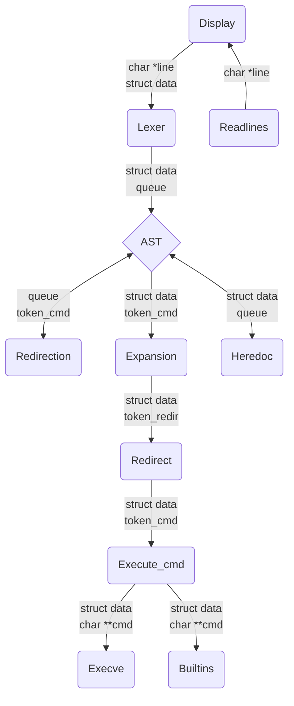

# Minishell

*This project has been created as part of the 42 curriculum by lguerbig and tle-floc.*

## Description

Minishell is a lightweight Unix shell written in C, inspired by Bash. It reproduces the core behavior of a real command interpreter: reading user input, parsing it, and executing commands, all built on top of low-level system calls.
The project is an exploration of how a shell works under the hood : process creation, file descriptor manipulation, signal handling and inter-process communication.

### Features

- Interactive prompt with a working command history (via GNU Readline).
- Command execution by searching the `PATH` variable, or by using a relative or absolute path.
- Quoting : single quotes (`'`) prevent all meta-character interpretation, while double quotes (`"`) prevent it except for the dollar sign (`$`). Unclosed quotes and unsupported special characters (such as `\` and `;`) are not interpreted.
- Redirections:
  - `<` redirects input.
  - `>` redirects output.
  - `<<` reads input until a delimiter line is found (heredoc).
  - `>>` redirects output in append mode.
- Pipes (`|`) : the output of each command in a pipeline is connected to the input of the next one.
- Environment variable expansion (`$VAR`) and exit status expansion (`$?`), which holds the exit status of the most recently executed foreground pipeline.
- Signal handling that behaves like Bash in interactive mode :
  - `Ctrl-C` displays a new prompt on a new line.
  - `Ctrl-D` exits the shell.
  - `Ctrl-\` does nothing.
- Built-in commands :
  - `echo` (with the `-n` option)
  - `cd` (with a relative or absolute path only)
  - `pwd`
  - `export`
  - `unset`
  - `env`
  - `exit`
- Logical operators `&&` and `||`, with parentheses to control priority.
- Wildcard expansion (`*`) for the current working directory.

### Technical constraints
- A single global variable is allowed, used only to store the number of a received signal. It carries no other information and gives no access to the program's data structures, so signal handlers never touch the main data.
- No memory leaks are tolerated in the project's own code (leaks originating from `readline()` itself are not considered).
- The scope is limited to the subject; when a behavior is ambiguous, Bash is used as the reference.
- This project must be written in accordance with the [42 Norm](https://github.com/42School/norminette).

### Allowed external functions
`readline`, `rl_clear_history`, `rl_on_new_line`, `rl_replace_line`, `rl_redisplay`, `add_history`, `printf`, `malloc`, `free`, `write`, `access`, `open`, `read`, `close`, `fork`, `wait`, `waitpid`, `wait3`, `wait4`, `signal`, `sigaction`, `sigemptyset`, `sigaddset`, `kill`, `exit`, `getcwd`, `chdir`, `stat`, `lstat`, `fstat`, `unlink`, `execve`, `dup`, `dup2`, `pipe`, `opendir`, `readdir`, `closedir`, `strerror`, `perror`, `isatty`, `ttyname`, `ttyslot`, `ioctl`, `getenv`, `tcsetattr`, `tcgetattr`, `tgetent`, `tgetflag`, `tgetnum`, `tgetstr`, `tgoto`, `tputs`

## Tools

| Tool | Version |
|------|---------|
| clang | 12 |
| valgrind | 3.18.1 |
| Make | any |

## Project architecture

```
project-root
├── minishell
│   └── [project files...]
├── unit_tester
│   └── [unit test files...]
├── .gitignore
├── en.subject.pdf
├── flake.lock
├── flake.nix
└── README.md
```

For this project, we have created our own [tester](unit_tester/README.md).

## General Process



## Instructions

### Nix

To avoid compatibility issues, you can use the Nix terminal :
```bash
nix develop
```
In particular, the terminal will have readline and Valgrind installed.

### Project

All commands are executed in the minishell directory.

#### Makefile

Use the provided `Makefile` to compile the project and manage it:

| Command | Description |
|--------|-------------|
| `make` / `make all` / `make bonus` | Compile the project |
| `make clean` | Remove object files |
| `make fclean` | Remove object files and executables |
| `make re` | Clean and recompile the project |

#### Run program

To launch the program :
```bash
./minishell
```

## Resources
- [Bash documentation](https://www.gnu.org/software/bash/manual/html_node/index.html)
