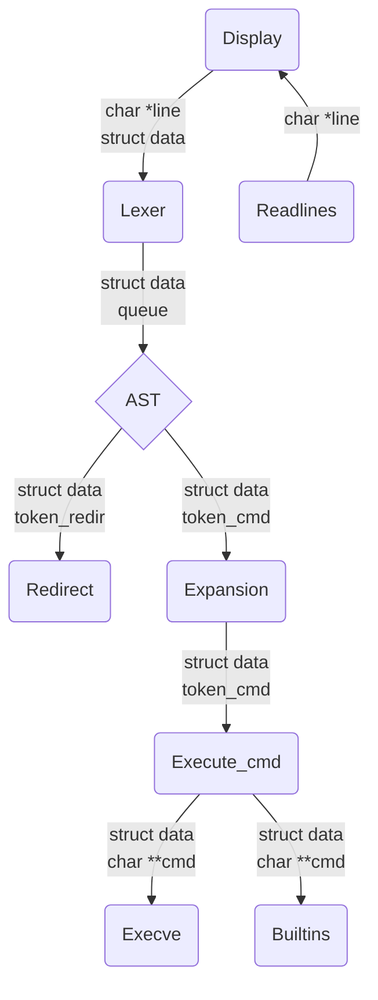
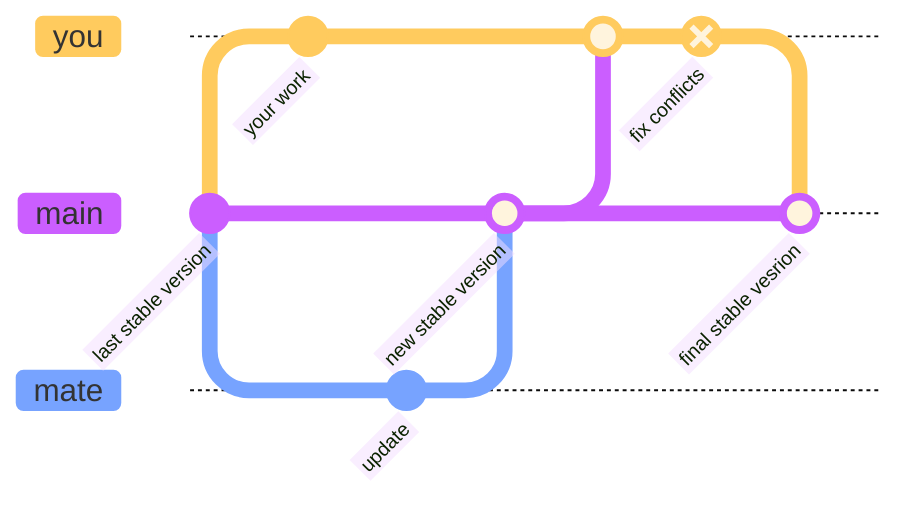

# 🖥️ minishell 🍼👶

## General rules 📏
### Coding ⌨️
- Every feature must have his header associated that is include in the main header `minishel.h`.
- Use a static function whenever is possible (must not appered in the header).
- All functions in the header should be organized like the files.
- The function must not be named `ft_*.c`.
- Comment every function:
  - **Goal**
  - **Return**
  - **Warning**
```c
/*
* Goal: Describe the global goal of your function.
*
* Return: What the fonction return (None for void() function).
*
* Warning: Cases that can be problematic.
*/
type function_name(args){}
```
- Every feature must have his complete unit test.
- Use the `unit test library` for your unit tests.


### Project Managment 📜
- Respect the [Git Organisation](#git-organisation)
- Merge on the `main` branch as soon as a feature is done
- Commit title must be formated like `KEY_WORD: commit title` with the followings key_words:
  - **ADD**
  - **UPDATE**
  - **REMOVE**
  - **FIX**
```bash
git commit -m 'KEY_WORD: commit title' -m 'commit description'
```
- Respect the [File Organisation](#file-organisation)


## File Organisation
-  Everything that needs to be pushed to the `vlogsphere` will be in a directory called `minishell`
- The rest will be organized in the root directory:
  - `README.md`
  - Unit tests
  - `.gitignore`
```plaintext
project-root/
├── minishell/
│   ├── [project files...]
├── README.md
├── .gitignore
├── unit_tester
    E --> F(Env);s/
│   ├── [unit test files...]
```

## General Process



## Git Organisation
### Work in your branch
See all branches (and what is the current branch)
```bash 
git branch
```
Create a new branch `branch_name`
```bash
git branch <branch_name>
```
Switch to a branch
```bash
git checkout <branch_name>
```
### Update your branch with current `main`
1. Switch to your branch (if you are on another) and push to ensure your branch is up-to-date before merging
```bash
git checkout <branch_name>
git push
```
2. Switch to the main branch and pull
```bash
git checkout main
git pull
```
3. Switch back to your branch and merge with the main branch
```bash
git checkout <branch_name>
git merge main
```
### Push Workflow
1. [Update your branch with current main](#update-your-branch-with-current-main)

2. Fix conflicts (if any), commit, and push the resolution

3. Run unit tests (fix failing tests if necessary, commit the fixes, and push)

4. Switch to `main`
```bash
git checkout main
```
5. Merge your work in main
```bash
git merge <branch_name>
```
6. Push modification
```bash
git push
```

## Sources
- [Bash documentation](https://www.gnu.org/software/bash/manual/html_node/index.html)
